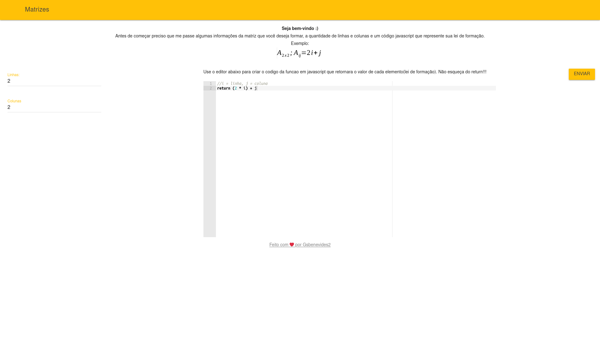

<h1 align="center">Matrizes</h1>

 <a href="https://matrizes.gui.dev.br" target="_blank">Veja ao vivo</a>

Gerador de matrizes matemáticas a partir de código javascript. Construído em React, essa aplicação web gera uma tabela contendo uma matriz, insirindo a quantidade de linhas, colunas e a transcrição da lei de formação em código JavaScript.

  

<h2>💻 Tecnologias</h2>
<ul>
    <li>React</li>
    <li>JavaScript</li>
    <li>HTML</li>
    <li>CSS</li>
</ul>
<h3>📚 Bibliotecas</h3>
<ul>
    <li>React Ace: Editor de código</li>
    <li>React MDL: Componentes de interface</li>
    <li>Styled Components: Estilização</li>
</ul>

<h2>📃 Licença</h2>

Este projeto está sobre a licença MIT. Veja ela em: <a href="LICENSE">LICENSE</a>.

Feito com 💛 por <a href="https://gui.dev.br">gsbenevides2</a>

